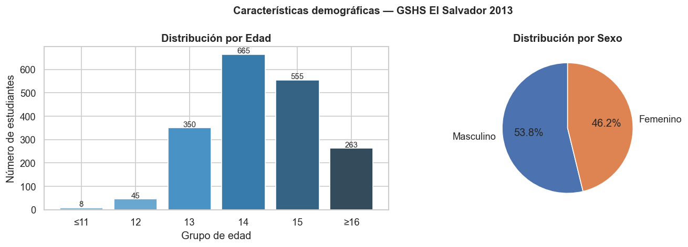
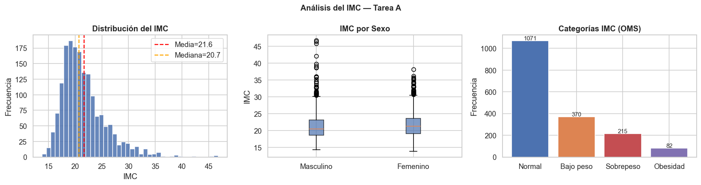
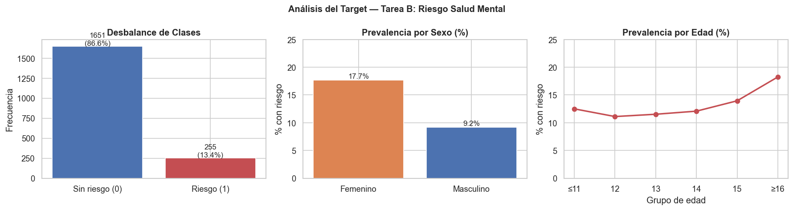

# 🏥 Sistema Predictivo de Factores de Riesgo — Adolescentes Salvadoreños (GSHS 2013)

[](https://www.python.org/downloads/)
[](https://scikit-learn.org/)
[](https://xgboost.readthedocs.io/)
[](https://imbalanced-learn.org/)
[](https://extranet.who.int/ncdsmicrodata/index.php/catalog/97)

Pipeline completo de Machine Learning aplicado a la **Encuesta Global de Salud Escolar (GSHS) 2013** de El Salvador, desarrollado para el **Ministerio de Salud (MINSAL)** como sistema de alerta temprana de factores de riesgo en adolescentes escolares.

El pipeline aborda dos tareas diferenciadas:
- **Tarea A — Regresión**: Estimación del Índice de Masa Corporal (IMC) desde variables de comportamiento
- **Tarea B — Clasificación**: Detección del riesgo de salud mental con técnicas para datos desbalanceados

---

## 📋 Tabla de contenidos

- [💡 Motivación](#-motivación)
- [🏆 Resultados](#-resultados)
- [🏗️ Arquitectura del pipeline](#️-arquitectura-del-pipeline)
- [⚙️ Instalación y ejecución](#️-instalación-y-ejecución)
- [📁 Estructura del proyecto](#-estructura-del-proyecto)
- [📊 Dataset](#-dataset)
- [🔧 Feature Engineering](#-feature-engineering)
- [📈 Tarea A — Regresión IMC](#-tarea-a--regresión-imc)
- [🧠 Tarea B — Clasificación Salud Mental](#-tarea-b--clasificación-salud-mental)
- [🎯 Variables predictoras clave](#-variables-predictoras-clave)
- [⚠️ Limitaciones](#️-limitaciones)
- [📚 Referencias](#-referencias)

---

## 💡 Motivación

El Salvador enfrenta una doble carga en salud escolar raramente cuantificada: el **21.3% de los adolescentes presenta bajo peso**, superando al sobrepeso y obesidad combinados (17.1%), mientras **1 de cada 7 estudiantes** reporta síntomas compatibles con riesgo de salud mental.

La GSHS 2013 (OMS/OPS) es el registro más completo disponible sobre comportamientos de riesgo en la población escolar salvadoreña. Este proyecto busca extraer valor predictivo de esos datos para orientar la focalización de recursos del MINSAL hacia las escuelas más vulnerables.

Un aspecto metodológico importante: el pipeline **no siguió una trayectoria lineal**. La primera versión de Tarea A usó variables binarias QN y produjo R² negativo, lo que obligó a regresar a Feature Engineering y rediseñar con columnas Q ordinales. La correlación máxima con el IMC aumentó de 0.05 a 0.116, aunque sin resolver el problema de fondo. Esta iteración documenta cómo opera un proyecto de ML real.

---

## 🏆 Resultados

### Tarea A — Regresión IMC

| Modelo                    | CV RMSE     | CV R²        | Test RMSE | Test R² |
| ------------------------- | ----------- | ------------ | --------- | ------- |
| Predictor trivial (media) | —           | —            | 4.155     | 0.000   |
| Regresión Lineal          | 4.19 ± 0.21 | −0.03 ± 0.02 | 4.201     | −0.026  |
| Random Forest Regressor   | 4.21 ± 0.18 | −0.04 ± 0.03 | 4.236     | −0.043  |

> **Conclusión:** R² negativo en ambos modelos — limitación estructural del instrumento GSHS, no fallo del pipeline. El GSHS fue diseñado para prevalencias poblacionales, no para predicción individual del IMC.

### Tarea B — Clasificación Riesgo Salud Mental

| Modelo              | F1        | AUC-ROC   | Recall    | FN     |
| ------------------- | --------- | --------- | --------- | ------ |
| LR Base             | 0.574     | 0.866     | 72.5%     | 14     |
| **LR Optimizada ★** | **0.574** | **0.865** | **72.5%** | **14** |
| XGBoost Base        | 0.584     | 0.841     | 64.7%     | 18     |
| XGBoost Optimizado  | 0.538     | 0.838     | 49.0%     | 26     |

> ★ **Modelo final**: Regresión Logística Optimizada. Criterio de selección clínico: mayor Recall (72.5%) → menos Falsos Negativos (14). En salud pública, un FN es un estudiante en riesgo no identificado.

**Hallazgos EDA clave:**



*Fig. 1. Perfil demográfico: muestra concentrada en 14–15 años, 53.8% femenino / 46.2% masculino.*



*Fig. 2. Bajo peso (21.3%) supera al sobrepeso + obesidad combinados (17.1%). La desnutrición es el problema nutricional dominante.*



*Fig. 3. Prevalencia 13.4%. Hallazgo contraintuitivo: hombres 17.7% vs. mujeres 9.3%. Pico en ≥16 años (18.2%).*

---

## 🏗️ Arquitectura del pipeline

```
data/raw/SLV2013_Public_Use.csv  (GSHS OMS/OPS 2013)
        ↓
01_exploracion_eda.ipynb
  └─ Detección marcador SPSS (1.79769313486232e+308 → NaN)
  └─ Auditoría de columnas, tipos, nulos
  └─ Construcción targets: IMC y Riesgo_SM
        ↓
02_limpieza_eda.ipynb
  └─ Eliminación 16 columnas (12 por nulos >60%, 2 leakage, 2 diseño muestral)
  └─ EDA profundo: demografía, IMC, salud mental
  └─ Figuras 02, 03, 04
  └─ → data/processed/slv2013_clean.csv
        ↓
03_feature_engineering_v2.ipynb          [v1 con QN → R² negativo → iteración]
  └─ 49 features Q ordinales (46 Q + 3 derivadas)
  └─ Imputación mediana/moda + RobustScaler (solo sobre train)
  └─ Split 80/20 estratificado (random_state=42)
  └─ → X_train_scaled_v2.csv, X_test_scaled_v2.csv, y_A/B_train/test_v2.csv
        ↓
04_regresion_imc_v2.ipynb                [v1 con QN → v2 con Q ordinales]
  └─ Regresión Lineal + Random Forest, CV 5-fold
  └─ Análisis de residuos, correlaciones, feature importance
  └─ Figuras 08, 09, 10
        ↓
05_clasificacion_riesgo.ipynb
  └─ SMOTE exclusivamente sobre train (ratio 1:1, 2,640 muestras)
  └─ LR + XGBoost, CV 5-fold post-SMOTE
  └─ Figuras 11, 12, 13
        ↓
06_optimizacion.ipynb
  └─ GridSearchCV sobre LR y XGBoost
  └─ Comparativa base vs. optimizado
  └─ Figuras 14, 15, 16
  └─ → models/modelo_final.pkl
      
```

---

## ⚙️ Instalación y ejecución

### Requisitos

- Python 3.11.5+
- VS Code con extensión Jupyter (o Jupyter Lab/Notebook)
- macOS / Linux (probado en macOS)

### Pasos

```bash
# 1. Clonar el repositorio
git clone https://github.com/jpurquilla/prediccion-factores-riesgo.git
cd prediccion-factores-riesgo

# 2. Crear entorno virtual
python3 -m venv venv
source venv/bin/activate          # macOS/Linux
# venv\Scripts\activate           # Windows

# 3. Instalar dependencias
pip install -r requirements.txt

# 4. Colocar el dataset
# Descargar SLV2013_Public_Use.csv desde:
# https://extranet.who.int/ncdsmicrodata/index.php/catalog/97
# y colocarlo en:
cp ~/Downloads/SLV2013_Public_Use.csv data/raw/

# 5. Abrir VS Code con Jupyter
code .
# Seleccionar el kernel del venv creado
```

### Ejecutar notebooks en orden

Los notebooks deben ejecutarse **secuencialmente** — cada uno consume artefactos del anterior.

```bash
jupyter lab
# o abrir directamente en VS Code
```

| Orden | Notebook                          | Descripción                              | Salida principal             |
| ----- | --------------------------------- | ---------------------------------------- | ---------------------------- |
| 1     | `01_exploracion_eda.ipynb`        | Inspección inicial, marcador SPSS, tipos | —                            |
| 2     | `02_limpieza_eda.ipynb`           | Limpieza, EDA profundo, figuras 02–04    | `slv2013_clean.csv`          |
| 3     | `03_feature_engineering_v2.ipynb` | 49 features Q ordinales, split, scaler   | `X_train/test_scaled_v2.csv` |
| 4     | `04_regresion_imc_v2.ipynb`       | Regresión Lineal + RF, residuos          | Figuras 08–10                |
| 5     | `05_clasificacion_riesgo.ipynb`   | SMOTE + LR + XGBoost base                | Figuras 11–13                |
| 6     | `06_optimizacion.ipynb`           | GridSearchCV, modelo final               | `modelo_final.pkl`           |

> ⚠️ Los notebooks `03_feature_engineering.ipynb` (v1, QN binarias) y `04_regresion_imc.ipynb` (v1) están preservados para documentar la iteración metodológica. **No ejecutar en lugar de la v2.**

### Reproducibilidad sin reentrenar

Los artefactos procesados y el modelo final están incluidos en `data/processed/` y `models/`.
Si solo quieres verificar los resultados de clasificación, puedes cargar directamente:

```python
import joblib
modelo = joblib.load('models/modelo_final.pkl')
```

---

## 📁 Estructura del proyecto

```
Prediccion-FactoresRiesgo/
│
├── data/
│   ├── raw/
│   │   └── SLV2013_Public_Use.csv          # Dataset original — NO MODIFICAR
│   └── processed/
│       ├── slv2013_clean.csv               # Dataset limpio (1,915 × 90)
│       ├── X_train_scaled_v2.csv           # Features entrenamiento escaladas
│       ├── X_test_scaled_v2.csv            # Features prueba escaladas
│       ├── y_A_train_v2.csv                # Target IMC — entrenamiento
│       ├── y_A_test_v2.csv                 # Target IMC — prueba
│       ├── y_B_train_v2.csv                # Target Riesgo_SM — entrenamiento
│       ├── y_B_test_v2.csv                 # Target Riesgo_SM — prueba
│       └── features_final_v2.txt           # Lista de 49 features usadas
│
├── notebooks/
│   ├── 01_exploracion_eda.ipynb            # Fase 1: inspección inicial
│   ├── 02_limpieza_eda.ipynb               # Fase 2: limpieza y EDA profundo
│   ├── 03_feature_engineering.ipynb        # Fase 3 v1 (QN binarias) — referencia
│   ├── 03_feature_engineering_v2.ipynb     # Fase 3 v2 (Q ordinales) ✅ usar este
│   ├── 04_regresion_imc.ipynb              # Fase 4 v1 (QN) — referencia
│   ├── 04_regresion_imc_v2.ipynb           # Fase 4 v2 (Q ordinales) ✅ usar este
│   ├── 05_clasificacion_riesgo.ipynb       # Fase 5: SMOTE + modelos base
│   └── 06_optimizacion.ipynb              # Fase 6: GridSearchCV + modelo final
│
├── models/
│   ├── robust_scaler_v2.pkl                # RobustScaler ajustado sobre train
│   ├── logistic_regression.pkl             # LR base
│   ├── xgboost_classifier.pkl             # XGBoost base
│   └── modelo_final.pkl                   # Regresión Logística Optimizada ★
│
├── reports/
│   ├── figures/
│   │   ├── 02_perfil_demografico.png
│   │   ├── 03_distribucion_imc.png
│   │   ├── 04_riesgo_salud_mental.png
│   │   ├── 05_verificacion_features_v2.png
│   │   ├── 08_correlaciones_imc_v2.png
│   │   ├── 09_residuos_regresion_v2.png
│   │   ├── 10_feature_importance_regresion.png
│   │   ├── 11_matrices_confusion.png
│   │   ├── 12_curva_roc.png
│   │   ├── 13_feature_importance_clasificacion.png
│   │   ├── 14_matrices_confusion_opt.png
│   │   ├── 15_curva_roc_comparativa.png
│   │   └── 16_feature_importance_lr_opt.png
│   └── ieee/
│       └── informe_ieee_GSHS2013_UR04002.pdf  # Informe final IEEE
│
├── src/
│   └── config.py                          # Rutas y constantes globales
│
├── requirements.txt
└── README.md
```

---

## 📊 Dataset

| Atributo               | Valor                                                       |
| ---------------------- | ----------------------------------------------------------- |
| Nombre                 | GSHS El Salvador 2013 (Public Use File)                     |
| Fuente                 | OMS/OPS — NCD Microdata Repository                          |
| URL                    | https://extranet.who.int/ncdsmicrodata/index.php/catalog/97 |
| Filas originales       | 1,915 estudiantes                                           |
| Columnas originales    | 104 variables                                               |
| Columnas tras limpieza | 90                                                          |
| Columnas eliminadas    | 16 (12 nulos >60%, 2 data leakage, 2 diseño muestral)       |

### Anomalía crítica

El valor `1.79769313486232e+308` representa **datos faltantes codificados por SPSS** (límite máximo de un flotante de 64 bits). Debe identificarse y reemplazarse por `np.nan` **antes** de cualquier operación de análisis, de lo contrario corrompe estadísticas descriptivas, imputaciones y modelos.

```python
# Detección — el marcador viene como string en el CSV
MISSING_SPSS = "1.79769313486232e+308"
df = pd.read_csv("SLV2013_Public_Use.csv", na_values=[MISSING_SPSS])
```

### Variables del dataset

| Grupo                           | Rango                 | Descripción                               | Cantidad                    |
| ------------------------------- | --------------------- | ----------------------------------------- | --------------------------- |
| `Q1`–`Q58`                      | Ordinal (4–7 niveles) | Preguntas originales GSHS                 | 46 usadas                   |
| `QN6`–`QN58`                    | Binaria (0/1)         | Recodificaciones OPS                      | Excluidas (colinealidad)    |
| `qnfrvgg`, `qnpa7g`, `qnpe5g`   | Binaria               | Indicadores derivados de comportamiento   | 3 usadas                    |
| `qnowtg`, `qnobeseg`, `qnunwtg` | Binaria               | Clasificación de peso (derivadas del IMC) | Excluidas (leakage)         |
| `Q4`, `Q5`                      | Continua              | Altura y peso                             | Excluidas (leakage Tarea A) |
| `Q26`, `QN26`                   | —                     | Target de Tarea B y vecino semántico      | Excluidas de features       |
| `weight`, `stratum`, `psu`      | —                     | Variables de diseño muestral              | Excluidas                   |

### Targets construidos

**Tarea A — IMC:**
```python
df['IMC'] = df['Q5'] / (df['Q4'] ** 2)
# Rango: 13.79 – 46.78 kg/m²  |  Media: 21.64  |  Mediana: 20.71
# NaN: 177 filas
```

**Tarea B — Riesgo_SM:**
```python
# QN26: 1 = sí ha sentido tristeza/desesperanza  |  2 = no
# Convención GSHS inversa: recodificar
df['Riesgo_SM'] = df['QN26'].map({1: 1, 2: 0})
# Prevalencia: 13.4% (n=255/1,906)  |  Desbalance: 6.47:1
```

---

## 🔧 Feature Engineering

### Estrategia: Q ordinales vs. QN binarias

| Versión              | Features        | Correlación máx. con IMC | R² regresión |
| -------------------- | --------------- | ------------------------ | ------------ |
| v1 (QN binarias)     | 50 features     | ~0.05                    | −0.025       |
| **v2 (Q ordinales)** | **49 features** | **0.116 (Q3)**           | **−0.026**   |

La v1 colapsó escalas ordinales de 7 niveles en binario, eliminando la granularidad necesaria para predecir una variable continua. La v2 usa las preguntas Q en su escala original.

### Features finales (49)

| Tipo                        | Variables                                | Cantidad |
| --------------------------- | ---------------------------------------- | -------- |
| Demográficas                | Q1 (edad), Q2 (sexo), Q3 (grado escolar) | 3        |
| Comportamiento alimentario  | Q6–Q12                                   | 7        |
| Actividad física            | Q17–Q22                                  | 6        |
| Salud mental                | Q23–Q27                                  | 5        |
| Sustancias                  | Q34–Q40                                  | 7        |
| Entorno escolar/familiar    | Q44–Q58                                  | 14       |
| Derivadas de comportamiento | qnfrvgg, qnpa7g, qnpe5g                  | 3        |
| Otras Q                     | Restantes Q disponibles                  | 4        |

### Pipeline de preprocesamiento

```python
# Imputación
from sklearn.impute import SimpleImputer

# Variables ordinales/comportamiento → mediana
imp_median = SimpleImputer(strategy='median')

# Variables demográficas Q1, Q2, Q3 → moda
imp_mode = SimpleImputer(strategy='most_frequent')

# Escalado — solo ajustar sobre train
from sklearn.preprocessing import RobustScaler
scaler = RobustScaler()
X_train_scaled = scaler.fit_transform(X_train)   # fit + transform
X_test_scaled  = scaler.transform(X_test)         # solo transform

# Partición estratificada
from sklearn.model_selection import train_test_split
X_train, X_test, y_train, y_test = train_test_split(
    X, y, test_size=0.20,
    stratify=y_B,          # estratificar por Riesgo_SM
    random_state=42
)
# Train: 1,524 muestras  |  Test: 382 muestras
```

---

## 📈 Tarea A — Regresión IMC

### Hallazgos EDA nutricional

| Categoría OMS          | Prevalencia | n     |
| ---------------------- | ----------- | ----- |
| Bajo peso (IMC < 18.5) | **21.3%**   | 370   |
| Normal (18.5–24.9)     | 61.6%       | 1,071 |
| Sobrepeso (25–29.9)    | 12.4%       | 215   |
| Obesidad (≥ 30)        | 4.7%        | 82    |

> El bajo peso supera al sobrepeso + obesidad combinados (17.1%). La política nutricional escolar de MINSAL debe priorizar la **desnutrición**, no la obesidad.

### Modelos y configuración

```python
from sklearn.linear_model import LinearRegression
from sklearn.ensemble import RandomForestRegressor
from sklearn.model_selection import cross_val_score

lr  = LinearRegression()
rf  = RandomForestRegressor(n_estimators=100, random_state=42)

# CV 5-fold sobre train
cv_scores_lr = cross_val_score(lr, X_train, y_A_train,
                                cv=5, scoring='neg_root_mean_squared_error')
```

### Top correlaciones con IMC

| Rank | Feature | Correlación Pearson | Descripción   |
| ---- | ------- | ------------------- | ------------- |
| 1    | Q3      | 0.116               | Grado escolar |
| 2    | Q20     | 0.093               | —             |
| 3    | Q21     | 0.093               | —             |
| 4    | Q22     | 0.083               | —             |
| 5    | Q52     | 0.080               | —             |

> Solo Q3 supera el umbral |r| = 0.10. **Ninguna variable de comportamiento alimentario o actividad física alcanza r > 0.06.** El GSHS fue diseñado para medir prevalencias poblacionales, no para predicción individual del IMC.

### Feature importance Random Forest (top 5)

| Rank | Feature | Importancia (impureza) |
| ---- | ------- | ---------------------- |
| 1    | Q52     | 0.044                  |
| 2    | Q49     | 0.041                  |
| 3    | Q9      | 0.040                  |
| 4    | Q8      | 0.038                  |
| 5    | Q7      | 0.038                  |

Variables de consumo de tabaco (Q7, Q8, Q9) y sustancias (Q49, Q52) lideran el modelo, sugiriendo asociación entre conductas de riesgo y desregulación metabólica.

---

## 🧠 Tarea B — Clasificación Salud Mental

### Hallazgos EDA de salud mental

| Dimensión          | Hallazgo                                                           |
| ------------------ | ------------------------------------------------------------------ |
| Prevalencia global | 13.4% (n=255 / 1,906)                                              |
| Por sexo           | Hombres **17.7%** vs. Mujeres **9.3%** — resultado contraintuitivo |
| Por edad           | Patrón en U: mínimo 12 años (9.1%), pico ≥16 años (18.2%)          |
| Desbalance         | 6.47:1 → justifica SMOTE                                           |

### SMOTE — manejo del desbalance

```python
from imblearn.over_sampling import SMOTE

smote = SMOTE(random_state=42)
X_train_sm, y_train_sm = smote.fit_resample(X_train_scaled, y_B_train)

# Antes: 1,320 sin riesgo / 204 con riesgo  (ratio 6.47:1)
# Después: 1,320 / 1,320                    (ratio 1:1)
# CRÍTICO: SMOTE SOLO sobre train — test preserva distribución real
```

### Modelos y configuración

```python
from sklearn.linear_model import LogisticRegression
from xgboost import XGBClassifier

lr  = LogisticRegression(max_iter=1000, random_state=42)
xgb = XGBClassifier(n_estimators=100, random_state=42, eval_metric='logloss')
```

### Optimización de hiperparámetros

```python
from sklearn.model_selection import GridSearchCV

# Regresión Logística
param_grid_lr = {
    'C': [0.01, 0.1, 1, 10, 100],
    'penalty': ['l1', 'l2'],
    'solver': ['liblinear', 'saga']
}

# XGBoost
param_grid_xgb = {
    'n_estimators': [100, 200],
    'max_depth': [3, 5, 7],
    'learning_rate': [0.01, 0.1, 0.2],
    'subsample': [0.8, 1.0]
}

gs = GridSearchCV(estimator, param_grid, cv=5,
                  scoring='f1', n_jobs=-1)
gs.fit(X_train_sm, y_train_sm)
```

> **Resultado de la optimización:** GridSearchCV no mejoró el desempeño en ningún caso. La LR se mantuvo estable (AUC 0.866→0.865) y XGBoost degradó levemente (0.841→0.838). Los modelos base ya explotaban la señal disponible.

### Caída CV → Test

| Espacio                            | F1    | AUC   |
| ---------------------------------- | ----- | ----- |
| CV post-SMOTE (50/50)              | ~0.86 | ~0.93 |
| Test distribución real (86.6/13.4) | 0.574 | 0.865 |

La caída no es sobreajuste — es una diferencia estructural de distribución entre el espacio balanceado en que opera la CV y el mundo real. Comportamiento documentado y esperado con SMOTE.

---

## 🎯 Variables predictoras clave

Basado en los coeficientes de la Regresión Logística Optimizada (modelo final):

| Variable | Descripción GSHS              | Rol         | Coeficiente | Acción MINSAL                          |
| -------- | ----------------------------- | ----------- | ----------- | -------------------------------------- |
| Q24      | Ideación suicida últimos 12m  | 🔴 Riesgo    | −2.775      | Protocolo orientación escolar urgente  |
| Q25      | Plan de suicidio últimos 12m  | 🔴 Riesgo    | −2.710      | Derivación inmediata a salud mental    |
| Q23      | Insomnio por ansiedad         | 🔴 Riesgo    | +0.741      | Tamizaje en controles anuales          |
| qnpa7g   | Días actividad física ≥60 min | 🔴 Riesgo*   | +1.019      | Revisar interpretación (confusor sexo) |
| Q55      | Apoyo parental percibido      | 🟢 Protector | +0.901*     | Talleres comunicación familiar         |
| Q39      | Consumo alcohol reciente      | 🔴 Riesgo    | +0.654      | Programas prevención temprana          |
| Q27      | Número de amigos cercanos     | 🟢 Protector | −0.594      | Programas integración social           |
| Q57      | Factor entorno social         | 🟢 Protector | −0.610      | Fortalecer redes de apoyo              |

> *Q55 aparece con coeficiente positivo por codificación inversa de la escala GSHS; es factor protector. qnpa7g requiere interpretación cuidadosa por posible confusión con la variable sexo.

> **Nota metodológica:** Q24 y Q25 son semánticamente adyacentes al target QN26 (intento de suicidio) en el instrumento GSHS. Su alta importancia refleja correlación estructural del cuestionario, no necesariamente causalidad independiente. En un sistema de alerta real, estas variables forman parte del mismo tamizaje.

---

## ⚠️ Limitaciones

1. **Antigüedad del dataset**: los datos tienen 13 años. Los patrones de comportamiento y prevalencias pueden haber cambiado significativamente desde 2013.

2. **Auto-reporte**: todas las variables son auto-reportadas, introduciendo sesgo de deseabilidad social especialmente en consumo de sustancias y salud mental.

3. **Techo de señal IMC**: la correlación máxima con el IMC no supera 0.12, estableciendo un límite teórico para cualquier modelo basado en estas features. El GSHS no fue diseñado para predicción individual de composición corporal.

4. **Generalización de Tarea B**: el desbalance 6.5:1 y el tratamiento con SMOTE limita la generalización a poblaciones con prevalencias de riesgo muy distintas al 13.4% observado en 2013.

5. **Variables de diseño muestral**: `weight`, `stratum` y `psu` fueron excluidas. Un análisis estadísticamente riguroso debería incorporarlas para inferencias poblacionales.

6. **Correlación estructural Q24/Q25**: la alta importancia de estas variables en Tarea B refleja proximidad semántica con el target, no predictores independientes identificados desde el comportamiento.

---

## 📚 Referencias

- OPS/OMS (2013). *Encuesta Global de Salud Escolar — El Salvador 2013*. Organización Panamericana de la Salud. https://extranet.who.int/ncdsmicrodata/index.php/catalog/97
- Chawla, N. V., Bowyer, K. W., Hall, L. O., & Kegelmeyer, W. P. (2002). SMOTE: Synthetic Minority Over-sampling Technique. *Journal of Artificial Intelligence Research*, 16, 321–357.
- Chen, T., & Guestrin, C. (2016). XGBoost: A Scalable Tree Boosting System. *Proceedings of the 22nd ACM SIGKDD*, 785–794.
- Pedregosa, F. et al. (2011). Scikit-learn: Machine Learning in Python. *JMLR*, 12, 2825–2830.
- Breiman, L. (2001). Random Forests. *Machine Learning*, 45(1), 5–32.
- James, G., Witten, D., Hastie, T., & Tibshirani, R. (2021). *An Introduction to Statistical Learning* (2nd ed.). Springer.
- MINSAL (2021). *Plan Nacional de Salud Mental El Salvador 2021–2025*. Ministerio de Salud, San Salvador.

---

*Proyecto académico — Desafío 2 — Curso de Especialización en Machine Learning — UES 2026*
*Autor: Pedro Juan Pablo Urquilla Ruiz — Carnet: UR04002*
